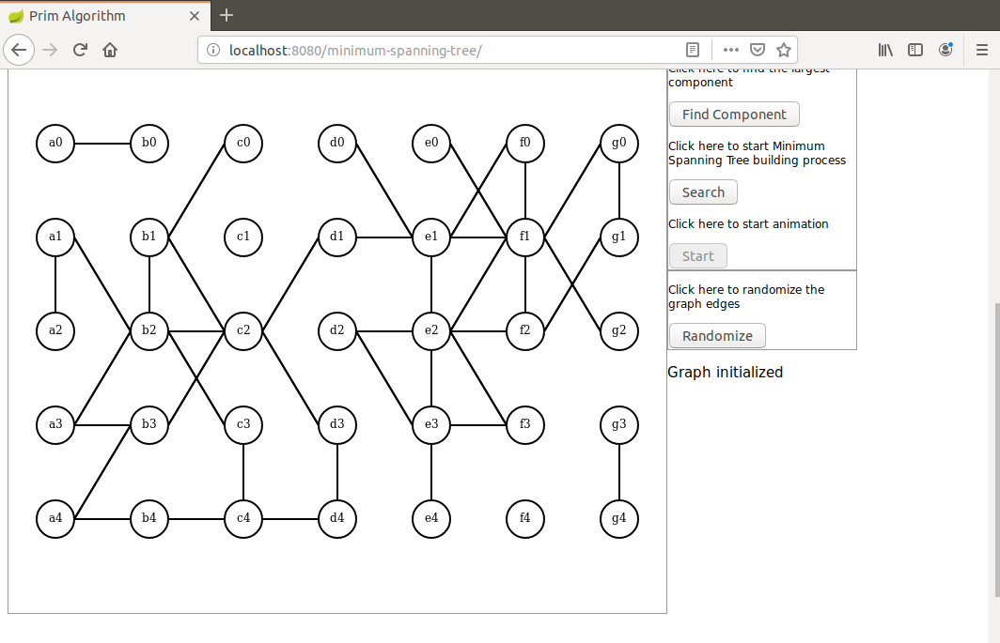

# prim-messenger
I present here a Java demo of the Minimum Spanning Tree using a parallelizable implementation of the Prim algorithm.

Here are the prerequisites to run this demo:

A recent Maven version installed (I use 3.6.0).
A recent Docker version installed (I use 19.03.11-ce)

The algorithm itself is implemented in Java, Javascript is only used for initialization and display on Canvas.

First an undirected graph is randomly created and its largest connected component is extracted (Java side).

Then a minimum spanning tree is built (Java side) with all intermediate results saved as a collection.

This collection is then sent to the browser as a JSON object.

The collection is used for an animated display (browser side).

In this version the algorithm is implemented by three workers running in Docker containers and a supervisor. All communication between supervisor and workers is implemented by a message broker. In this way workers don't expose any port. The message broker is RabbitMQ running in a Docker container. The Java code itself is broker agnostic. It uses the interfaces org.springframework.cloud.stream.messaging.Source and org.springframework.cloud.stream.messaging.Sink only.

The only explicit reference to RabbitMQ is this Maven dependency:

```
<dependency>
    <groupId>org.springframework.cloud</groupId>
    <artifactId>spring-cloud-starter-stream-rabbit</artifactId>
</dependency>
```

Here is the application.yml file for the supervisor:

```
server:
  port: 8080
  servlet:
    context-path: /
    

spring:
  rabbitmq:
    host: localhost
    port: 5672
    username: guest
    password: guest
    virtual-host: /
                
  cloud:
    stream:
      bindings:
        input:
          destination: primReceiveFromAll
        output:
          destination: primBroadcastAll
           
worker-number: 3
``` 

The task partitioning between supervisor and workers closely follows the description given in this textbook:

Guide to Graph Algorithms, K. Erciyes, Springer

Here are the containers used in the demo:

| Service name    | Image                     | Role   | Port exposed |
| --------------- | ------------------------- | ------ | ------------ |
| rabbitmq-server | rabbitmq:3.8.5-management | broker | 5672         |
| worker-1        | prim/worker               | worker | none         |
| worker-2        | prim/worker               | worker | none         |
| worker-3        | prim/worker               | worker | none         |

# Building Docker image
To build the Docker image run the command `sudo mvn spring-boot:build-image` in subdirectory worker. It uses the natice Docker support provided by Spring Boot release 3.2. It builds a docker image named worker:0.0.1-SNAPSHOT. 

# Launching the demo

## Launching the workers
To launch the workers and the RabbitMQ broker run the command `sudo docker-compose up` in subdirectory docker. Note that the RabbitMQ exchanges used by this application are automatically created behind the scene by Spring Cloud. The existence of the two exchanges can be checked by opening the RabbitMQ management GUI on port 15672


## Launching the supervisor
To launch the supervisor run the command `mvn spring-boot:run` in subdirectory supervisor.

When the application has started open a browser and hit URL `http://localhost:8080/minimum-spanning-tree`.

Here are some screen shots that can be seen in this demo.

After graph initialization:


After the component was found:


After the end of the animation:


The messaging architecture is shown on this picture:


For a video demo follow this link:

https://youtu.be/35Gx8oCIrb8 


Dominique Ubersfeld, Cachan, France
